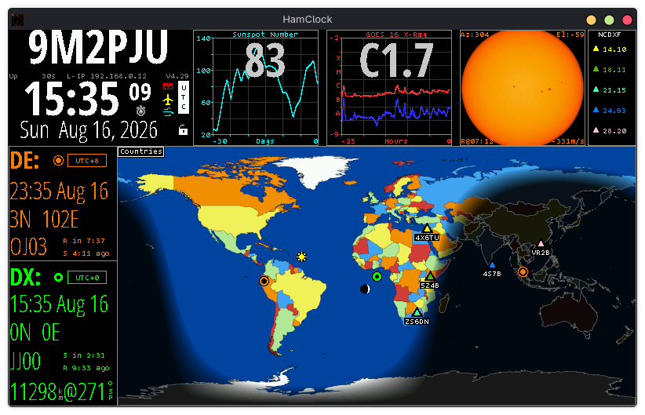

# ESPHamClock / OpenHamClock

<div align="center">

```
  _    _                 _____ _            _    
 | |  | |               / ____| |          | |   
 | |__| | __ _ _ __ ___| |    | | ___   ___| | __
 |  __  |/ _` | '_ ` _ \ |    | |/ _ \ / __| |/ /
 | |  | | (_| | | | | | | |___| | (_) | (__|   < 
 |_|  |_|\__,_|_| |_| |_|\____|_|\___/ \___|_|\_\
```

### *The Quintessential Space Weather, Radio Propagation & Telemetry Dashboard for Amateur Radio*

[](file:///home/x/ESPHamClock/version.cpp)
[-brightgreen.svg?style=for-the-badge&logo=server)](https://ohb.hamclock.app)
[](https://github.com/9M2PJU/ESPHamClock)
[](file:///home/x/ESPHamClock/LICENSE)

<br/>

<p align="center">
  
</p>

---

[Origin & Tribute](#-origin--the-silent-key-legacy) •
[OHB Migration](#-the-open-hamclock-backend-ohb-era) •
[Features](#-feature-matrix) •
[One-Liner Install](#-one-liner-quick-install) •
[Manual Build](#-manual-compilation--build-matrix) •
[CLI & Web Server](#-remote-web-interface--rest-api) •
[Autostart](#-systemd-service--autostart)

---

</div>

## 🕊️ Origin & The Silent Key Legacy

**HamClock** was conceived, architected, and brought to life by **Elwood Downey (WB0OEW)** under the banner of **Clear Sky Institute**. 

Elwood—an accomplished astronomer, software architect (renowned creator of *XEphem*), and passionate radio amateur—originally designed HamClock as a compact, self-contained microcontroller project for the **Adafruit Feather HUZZAH ESP8266** paired with an Adafruit RA8875 TFT driver. 

As the project gained massive popularity across the global amateur radio community, Elwood continuously expanded its capabilities, developing an elegant POSIX abstraction layer ([`ArduinoLib`](file:///home/x/ESPHamClock/ArduinoLib)) that allowed the exact same codebase to compile natively on **Linux, Raspberry Pi, Inovato Quadra, macOS, and FreeBSD**. For years, Elwood personally financed and hosted the high-reliability Clear Sky Institute backend servers that parsed NOAA space weather, satellite TLEs, VOACAP models, and solar imagery for tens of thousands of clocks worldwide.

With Elwood Downey becoming **Silent Key (SK)**, the original Clear Sky Institute infrastructure ceased operations. Rather than letting this indispensable amateur radio instrument fade into history, the worldwide ham radio community mobilized to keep his legacy alive.

```
       +--------------------------------------------------------------+
       |   In Memory of Elwood Downey, WB0OEW (Silent Key - SK)       |
       |   "His signals continue to propagate across the globe."      |
       +--------------------------------------------------------------+
```

---

## 🌐 The Open HamClock Backend (OHB) Era

To ensure HamClock remains fully functional, reliable, and open for future generations of radio operators, an international collective of amateur radio enthusiasts developed the **Open HamClock Backend (OHB)**.

### What Changed in Version 4.24+ (Current: 4.29)

- **Hard-Coded Community Backend**: HamClock now connects directly to `ohb.hamclock.app:80` by default.
- **No Switching Scripts or DNS Redirection Required**: Older transitional scripts (`sudo ohb`, `sudo fix-hosts`, `sudo csi`) and manual `/etc/hosts` modifications are no longer required.
- **Seamless Upgrade**: Full backward compatibility with existing user configurations, callsign profiles, and NVRAM settings in `~/.hamclock/`.
- **Modern Service Restorations**: Space weather feeds, NOAA alerts, SDO solar imagery, VOACAP HF propagation models, DX cluster spots, satellite orbital TLEs, and contest calendars are completely restored and maintained on high-availability community servers.

---

## 📊 Feature Matrix

<div align="center">

| Subsystem | Capabilities & Integrations |
| :--- | :--- |
| **☀️ Space Weather** | Live Solar Flux Index (SFI), Sunspot Number (SSN), Planetary Kp & Ap indices, X-ray solar flare flux, solar wind velocity & density, interplanetary magnetic field ($B_z$ / $B_t$), NOAA alerts, and real-time Solar Dynamics Observatory (SDO) EUV imagery. |
| **📻 Propagation & Bands** | VOACAP point-to-point HF propagation prediction engine, real-time 80m–10m band condition matrix, Take-Off Angle (TOA) adjustments, and live synchronized NCDXF/IARU international beacon monitoring. |
| **🗺️ Cartography & Grayline** | High-resolution Mercator, Robinson, and Azimuthal (Great Circle / beam heading) projections centered on your DE (QTH). Live day/night terminator (grayline) mapping, Maidenhead 6-character grid overlays, CQ zones, and ITU zones. |
| **📡 DX Cluster & Digital Modes** | Live DX cluster telnet/web ingestion, PSK Reporter FT8/FT4/CW real-time spot pins on the globe, callsign DXCC prefix database lookup, and custom callsign watchlists with audio/visual alerts. |
| **🛰️ Satellites, EME & Rotators** | Orbit calculation via Plan-13 algorithm for ISS and amateur satellites, next pass predictions, Doppler shift estimation, Earth-Moon-Earth (EME) mutual visibility windows, and automated Az/El antenna rotor/gimbal control (rotctld, Yaesu, Easycomm). |
| **📜 Logbook & Rig Control** | Real-time ADIF log ingestion from WSJT-X, N1MM Logger+, and standard loggers; on-air QSO pins plotted live; Flrig and rigctld CAT transceiver tracking. |
| **⏱️ Clocks & Geolocation** | Dual DE/DX local timezones, UTC precision display, sub-second NTP synchronization, hardware NMEA GPS & `gpsd` daemon support, IP geolocation, and stopwatch/timer controls. |
| **🌐 Built-in Web Server** | Interactive WebSocket remote mirror (port `8081`) for touch/click browser control, read-only monitor (port `8082`), and RESTful HTTP API (port `8080`) for screenshots and automation. |

</div>

---

## ⚡ One-Liner Quick Install

Use the universal automated installation script to install build dependencies, compile the optimized binary for your hardware, and create application menu shortcuts:

### Linux / Raspberry Pi / Inovato Quadra / Ubuntu / Debian / Arch / Fedora
```bash
curl -fsSL https://raw.githubusercontent.com/9M2PJU/ESPHamClock/main/install.sh | bash
```

### macOS (Apple Silicon & Intel)
> *Requires [Homebrew](https://brew.sh/) and [XQuartz](https://www.xquartz.org/).*
```bash
curl -fsSL https://raw.githubusercontent.com/9M2PJU/ESPHamClock/main/install.sh | bash
```

### FreeBSD
```bash
curl -fsSL https://raw.githubusercontent.com/9M2PJU/ESPHamClock/main/install.sh | bash
```

### Local Execution
```bash
git clone https://github.com/9M2PJU/ESPHamClock.git
cd ESPHamClock
./install.sh
```

---

## 🔨 Manual Compilation & Build Matrix

HamClock compiles natively on Unix-like operating systems. You can select your display resolution and output mode depending on your hardware:

### 1. Install Prerequisites

#### Debian / Ubuntu / Raspberry Pi OS / Inovato Quadra
```bash
sudo apt update
sudo apt install -y build-essential make g++ libx11-dev libgpiod-dev curl unzip pkg-config
```

#### Arch Linux / CachyOS / Manjaro
```bash
sudo pacman -Syu --needed base-devel libx11 libgpiod curl unzip
```

#### Fedora / RHEL
```bash
sudo dnf install -y gcc-c++ make libX11-devel libgpiod-devel curl unzip
```

#### macOS
```bash
brew install make gcc
brew install --cask xquartz
```

#### FreeBSD
```bash
sudo pkg install -y gmake gcc libX11 libgpio curl unzip
```

---

### 2. Choose Build Target & Resolution

HamClock provides three output architectures across four resolutions:

| Target Resolution | X11 Desktop GUI | Headless Web Server Only | RPi Direct Framebuffer (`/dev/fb0`) |
| :--- | :--- | :--- | :--- |
| **800 × 480** *(Standard)* | `make hamclock-800x480` | `make hamclock-web-800x480` | `make hamclock-fb0-800x480` |
| **1600 × 960** *(Large)* | `make hamclock-1600x960` | `make hamclock-web-1600x960` | `make hamclock-fb0-1600x960` |
| **2400 × 1440** *(Hi-DPI)* | `make hamclock-2400x1440` | `make hamclock-web-2400x1440` | `make hamclock-fb0-2400x1440` |
| **3200 × 1920** *(4K UHD)* | `make hamclock-3200x1920` | `make hamclock-web-3200x1920` | `make hamclock-fb0-3200x1920` |

#### Build Example (800x480 Desktop GUI)
```bash
make clean
make hamclock-800x480 -j$(nproc)
```

#### Install System-Wide
```bash
sudo make install
```
*Copies the binary to `/usr/local/bin/hamclock` with setuid privileges if required for native GPIO/framebuffer access.*

---

## 🕹️ CLI Options & Runtime Flags

```
Purpose: Display space weather, propagation, and telemetry for radio amateurs
Usage:   hamclock [options]
```

| Flag | Argument | Description | Example |
| :--- | :--- | :--- | :--- |
| `-k` | *none* | Skip initial setup countdown and boot immediately | `hamclock -k` |
| `-g` | *none* | Auto-initialize DE location using public IP geolocation *(requires `-k`)* | `hamclock -k -g` |
| `-b` | `<host:port>`| Override backend server *(default: `ohb.hamclock.app:80`)* | `hamclock -b ohb.hamclock.app:80` |
| `-f` | `on` / `off` | Force initial fullscreen display mode | `hamclock -f on` |
| `-d` | `<directory>`| Specify working directory *(default: `~/.hamclock/`)* | `hamclock -d /opt/hamclock_data` |
| `-e` | `<port>` | RESTful web server port *(default: `8080`, `-1` to disable)* | `hamclock -e 8080` |
| `-w` | `<port>` | Read-write live web server port *(default: `8081`, `-1` to disable)* | `hamclock -w 8081` |
| `-r` | `<port>` | Read-only live web server port *(default: `8082`, `-1` to disable)* | `hamclock -r 8082` |
| `-t` | `<percent>` | Throttle maximum CPU usage percentage *(default: `80`)* | `hamclock -t 50` |
| `-m` | *none* | Enable demo mode | `hamclock -m` |
| `-v` | *none* | Display version and build information | `hamclock -v` |
| `-h` | *none* | Display comprehensive help and command options | `hamclock -h` |

---

## 🌐 Remote Web Interface & REST API

When HamClock is running (either locally or on a remote server/Raspberry Pi), open any web browser:

- **Interactive Live Mirror (Read/Write)**:
  ```
  http://<clock-ip-address>:8081/live.html
  ```
  *Provides a real-time, touch- and click-interactive mirror of the screen over WebSocket.*

- **Read-Only Monitor**:
  ```
  http://<clock-ip-address>:8082/live.html
  ```

- **RESTful Snapshot / Image Endpoint**:
  ```
  http://<clock-ip-address>:8080/live.png
  ```

---

## 🔄 Systemd Service & Autostart

### 1. Desktop GUI Autostart
To start HamClock automatically upon graphical desktop login:
```bash
mkdir -p ~/.config/autostart
cp hamclock.desktop ~/.config/autostart/
chmod +x ~/.config/autostart/hamclock.desktop
```

### 2. Headless or Kiosk Systemd Service
To run HamClock automatically in the background at boot:
```bash
sudo cp hamclock.service /etc/systemd/system/
sudo systemctl daemon-reload
sudo systemctl enable --now hamclock
sudo systemctl status hamclock
```

---

## 🛠️ Microcontroller Support (ESP8266)

For legacy standalone microcontroller builds on the **Adafruit Feather HUZZAH ESP8266** with Adafruit RA8875 driver:

1. Install and open the **Arduino IDE**.
2. Install the ESP8266 board definitions and required libraries (`Adafruit_RA8875`, `Adafruit_BME280`).
3. Open [`ESPHamClock.cpp`](file:///home/x/ESPHamClock/ESPHamClock.cpp) (or `ESPHamClock.ino`).
4. Select `Adafruit Feather HUZZAH ESP8266`, CPU Frequency `160 MHz`, Flash Size `4M (3M SPIFFS)`.
5. Compile and upload.

---

## 🤝 Contributing & Community

Contributions, bug fixes, and feature enhancements are welcome!

1. Fork the repository.
2. Create your feature branch from `Staging` (`git checkout -b feature/my-new-feature`).
3. Commit your changes.
4. Push to your branch and open a Pull Request.

---

## 📄 License & Acknowledgments

- **Original Creator**: Elwood Downey, WB0OEW (Clear Sky Institute).
- **Backend & Community Maintenance**: The Open HamClock (OHB) amateur radio community.
- **License**: Custom Amateur Radio Non-Commercial License (see [`LICENSE`](file:///home/x/ESPHamClock/LICENSE)).

<div align="center">

```
73 to all Radio Amateurs worldwide! de 9M2PJU
```

</div>
